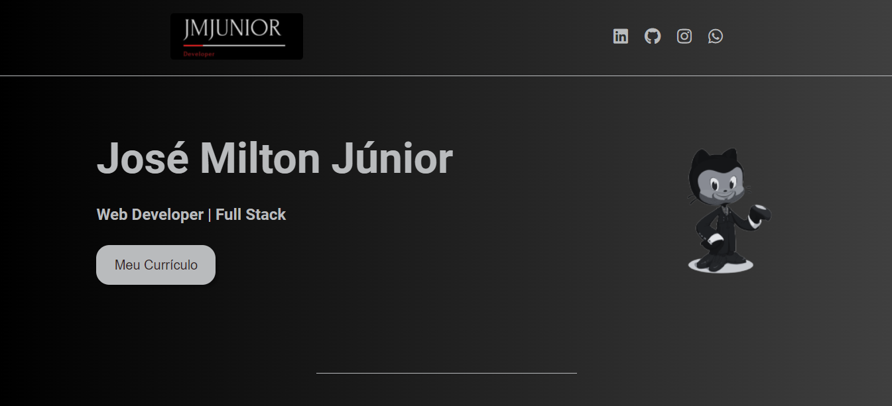
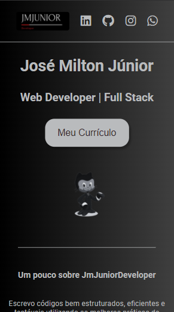

<h1 align="center">
    My Page JmJuniorDev
</h1>

Site de apresentação, utilizando conceitos de HTML e CSS aprendidos com o vídeo da Rafaella Bellerini.

Utilizei também conhecimentos para criar a responsividade e acrescentar algumas ferramentas como Fontawesome e iframe para download de documentos.

  

### Ferramentas usadas: :rocket:

- HTML5
- CSS3
- Fontawesome

Made By JmJunior :computer:
